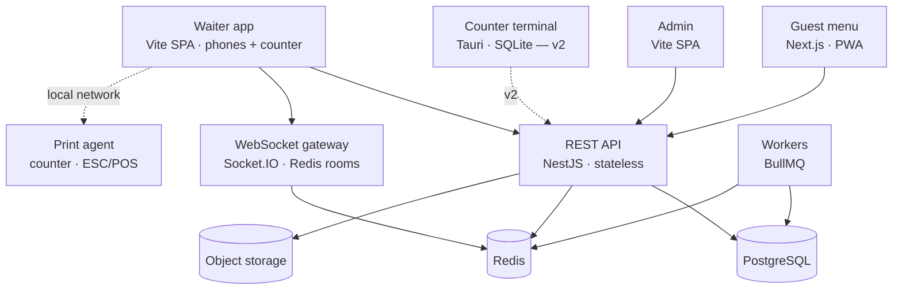

# DigiM

QR-code menus, instant orders and waiter calls for restaurants on the Adriatic coast.

A guest scans the code on their table, browses the menu in their own language, sends an order
straight to the waiter, and calls for service without waving. Staff get a live floor view; owners
get a menu editor and a dashboard.

---

## Status

**v1 is in planning.** This document is the architecture and the build order.

| | |
| --- | --- |
| **v1 — ordering** | Guest menu, orders, waiter calls, waiter app, manual order entry, table merging, kitchen ticket printing, shifts and clock-in, menu editor, analytics |
| **v2 — money** | Bills, cash and card payments, receipts, fiscalization, split-the-bill, the counter terminal, full offline operation |

v1 exists to answer one question: **will guests order from their phones, and does it save the
waiter time?** Payment infrastructure is worthless if the answer is no, so the expensive and risky
work — local-first sync and tax law — sits behind it.

Everything in v1 is nonetheless built so that v2 is an addition rather than a rewrite. See
[Hard to reverse](#hard-to-reverse).

---

## The surfaces

| Route | Who | Auth | Rendering |
| --- | --- | --- | --- |
| `/menu/:restaurant/:table` | Guests, straight off the QR code | None, by design | Server-rendered, then live |
| Waiter app | Waiters and managers | Staff login + PIN | SPA, websocket-driven |
| Admin | Owners and managers | Staff login | SPA |

**No login for guests.** No signup, no email capture. Scan and browse.

---

## Architecture



The API tier is stateless — scaling is "run more containers". Everything that must hold regardless
of which client is asking (pricing, permissions, table merges, cooldowns) lives there once.

Clients never talk to Postgres directly. That is the main departure from the prototype in this
repo's history, and the reason for it is simple: business rules like shift approvals and table
merges do not belong in row-level security predicates.

---

## Tech stack

Every row is portable. No managed service holds the data.

### Frontend

| Layer | Choice | Why |
| --- | --- | --- |
| Repo | pnpm workspaces + Turborepo | One PR can change the API and every client together |
| Guest app | Next.js (App Router) | The only surface where first paint on hotel wifi decides whether someone orders |
| Waiter app | Vite + React + TS | Long-lived SPA. No SEO, no cold loads, no server runtime to host |
| Admin app | Vite + React + TS | Desktop, authenticated, chart-heavy |
| UI | Tailwind + shadcn/ui | Components live in the repo, not in a dependency you can't patch |
| Charts | Apache ECharts | Handles dense dashboards and heatmaps without a fight |
| Forms | React Hook Form + Zod | Same schemas as the API |

### Backend

| Layer | Choice | Why |
| --- | --- | --- |
| API | NestJS (TypeScript) | Opinionated module/DI structure keeps AI-generated code reviewable |
| Contract | REST + OpenAPI 3 | Typed client generated into `packages/api-client`. A POS vendor can consume OpenAPI; they can't consume tRPC |
| Validation | Zod, shared | One schema per shape, imported by API and clients. Rules can't drift between tiers |
| Realtime | Socket.IO + Redis adapter | Rooms per restaurant. The adapter is what lets you run more than one API instance |
| Jobs | BullMQ on Redis | Rollups, notifications, and later fiscal submissions |
| Staff identity | Zitadel Cloud (EU) | Managed. Nobody on the team runs production Linux, so an IdP to patch is a liability |
| Guest tokens | Own — signed, scoped, short-lived | No IdP models an anonymous table session |

### Data

| Layer | Choice | Why |
| --- | --- | --- |
| Database | PostgreSQL 16, managed in EU | Aiven, Crunchy Bridge or Scaleway. Don't self-manage — backups and PITR are the last thing to own |
| ORM | Drizzle + drizzle-kit | SQL-first, fully typed, migrations readable in git |
| Cache & queue | Redis / Valkey | Sessions, rate limits, pub/sub, jobs |
| Files | S3-compatible | Hetzner Object Storage or Cloudflare R2. MinIO locally so dev matches prod |
| Analytics | Postgres now, ClickHouse later | Append-only events plus nightly rollups carries you to millions of rows |

### Infrastructure

| Layer | Choice | Why |
| --- | --- | --- |
| Hosting | Managed containers, EU region | Render or Railway (Frankfurt), or Scaleway. Portability comes from the Dockerfile, not the provider |
| Exit plan | Hetzner + Docker Compose | Same images on your own VMs. Move when hosting costs exceed an ops salary |
| Edge | Cloudflare | DNS, TLS, caching, WAF in front of the guest app — the only unauthenticated surface |
| CI/CD | GitHub Actions → GHCR | Build once, tag by commit, same image to staging then production |
| Config | Platform config in the repo | Full OpenTofu comes with the move to your own servers, not before |
| Tests | Vitest · Testcontainers · Playwright | Pricing and merge logic tested against real Postgres, never a mock |
| Observability | Sentry + OpenTelemetry → Grafana | When a station goes quiet mid-service you need traces, not guesses |

### Hardware

| Layer | Choice | Why |
| --- | --- | --- |
| Printing | ESC/POS over Ethernet | Epson TM or Star. A network printer reconnects on its own; a USB cable behind a bar gets kicked out at 9pm |
| Counter terminal (v2) | Tauri + SQLite | The till. ~10 MB binary instead of Electron's ~150 MB, with native hardware access |
| Offline sync (v2) | PowerSync or an outbox you own | Postgres ↔ SQLite is solved with sharp edges. Buy the protocol |

---

## Repository layout

```
apps/
  guest/            Next.js — the customer menu
  waiter/           Vite SPA — floor and counter
  admin/            Vite SPA — owner dashboard
  api/              NestJS — every business rule
  print-agent/      small binary at the counter, ESC/POS
packages/
  ui/               shared components
  types/            shared Zod schemas and domain types
  api-client/       generated from OpenAPI
infra/
  docker/           Dockerfiles and compose for local dev
  migrations/       Drizzle migrations
```

---

## Hard to reverse

Four schema decisions that cost nothing in v1 and are painful migrations afterwards. They are the
reason the stack looks the way it does.

### 1. Table sessions, not table IDs

A **table session** is a party occupying one or more tables for one visit. Orders, waiter calls and
the bill attach to the *session*, never to a table.

This is what makes merging work, and merging is not optional — pushing two tables together for a
party of eight happens constantly on a terrace in August.

| Operation | What it is |
| --- | --- |
| Open | First scan or waiter action creates a session on table 4 |
| Merge | Attach table 5 to that session; both QR codes reach the same bill |
| Split | Move selected orders to a new session |
| Transfer | Party moves inside — detach table 4, attach table 12 |
| Close | Session ends, tables free, the visit becomes an analytics record |

A schema with `order.table_id` cannot express any of this.

### 2. UUIDv7 keys, minted client-side

No server sequences anywhere. A terminal that will one day create orders offline cannot depend on
the database to hand out an ID. UUIDv7 sorts by time, so ordering survives without a central
counter.

### 3. Payable units, not atomic order lines

Three beers on one line is three claimable things — either split the line or carry
`paid_quantity`. Split-the-bill in v2 is an afternoon if the schema already says this, and a
rewrite if it doesn't.

### 4. A session has many receipts

Not one bill per table. In a fiscalized country **each payment is its own fiscal receipt**, so
splitting a bill four ways means four receipts against one session. Model the plural now.

### Also from day one

**An append-only `events` table** — every order, status change, waiter call, merge and clock event.
Analytics you haven't thought of yet can be derived later from events you recorded today, but never
from events you didn't. It is the cheapest thing on this list and the only one you cannot backfill.

**`order.source`** — `guest` | `waiter` | `pos`. Makes waiter-entered orders a first-class path
rather than a workaround, and it's the number owners care about most: what share of orders the app
actually handles.

---

## Roadmap

### Phase 00 — Foundations `v1`

- [ ] Monorepo: pnpm workspaces + Turborepo
- [ ] `docker-compose` for local dev: Postgres, Redis, MinIO
- [ ] GitHub Actions on every PR: lint, typecheck, unit tests, build
- [ ] Three environments with separate databases: local, staging, production
- [ ] Schema v1 as Drizzle migrations, committed to git
- [ ] `restaurant_id` on every row, enforced in a base repository **and** by Postgres RLS
- [ ] UUIDv7 primary keys minted client-side
- [ ] Schema models payable units and many receipts per session
- [ ] Zitadel Cloud (EU): one organization per restaurant
- [ ] Own token service for anonymous guest table sessions
- [ ] PIN unlock for switching waiters on the shared counter tablet
- [ ] Roles — owner / manager / waiter — checked in one guard
- [ ] OpenAPI generated from NestJS; typed client generated
- [ ] Sentry + OpenTelemetry in the API and all clients
- [ ] Structured JSON logs with a request ID threaded through

### Phase 01 — Guest ordering `v1`

- [ ] Signed table tokens in QR URLs, not raw database IDs
- [ ] Menu rendering: four languages, allergens, photos, sold-out state
- [ ] Cart in localStorage, keyed to the table session
- [ ] `POST /orders` re-prices every line server-side and rejects sold-out items
- [ ] Waiter call with a server-enforced cooldown
- [ ] Offline queue: orders retry when the connection returns
- [ ] Service worker caches the menu; cache headers set deliberately
- [ ] Lighthouse budget in CI — first paint under 1.5s on simulated 3G
- [ ] Keyboard and screen-reader pass on the ordering flow

### Phase 02 — Waiter app `v1`

No money changes hands anywhere in this phase.

- [ ] QR at the counter opens the waiter login page — rate-limited, since the URL is public
- [ ] Print agent at the counter: ESC/POS kitchen tickets over the local network
- [ ] Print queue with retries; anything unacknowledged shows in red until a human clears it
- [ ] One-tap reprint, marked as a reprint so nothing gets cooked twice
- [ ] Queue-and-retry when the connection drops, with an unmistakable degraded state
- [ ] WebSocket gateway with the Redis adapter, rooms per restaurant
- [ ] Live order feed with status transitions and an audit trail
- [ ] Waiter call feed: which table, how long ago, acknowledge
- [ ] Manual order entry — full menu, notes, quantities
- [ ] Table sessions: open and close
- [ ] Merge and split: multiple tables on one session
- [ ] Transfer a session when the party moves
- [ ] On every reconnect, refetch open sessions
- [ ] Audio alerts, wake lock, offline overlay

### Phase 03 — Shifts and hours `v1`

- [ ] Shift schedule model and a week-view calendar
- [ ] Clock in / out stamped by the server, never the device clock
- [ ] Optional on-premise check for clock-in
- [ ] Shift swap: request, colleague accepts, manager approves
- [ ] Notifications for swap requests and approvals
- [ ] Working-hours export in the format the accountant needs
- [ ] Manager view: who is on, who is late, hours this week

### Phase 04 — Analytics `v1`

- [ ] Append-only events table written by every state change
- [ ] Nightly jobs rolling events into hourly and daily summaries
- [ ] Revenue, covers, average check, items by volume and margin
- [ ] Heatmap: orders by hour × weekday
- [ ] Table performance: turnover, median session length, calls per table
- [ ] Staff view: orders handled, median time to acknowledge
- [ ] Menu engineering quadrant — margin against popularity
- [ ] Custom date ranges with period comparison
- [ ] CSV and XLSX export

### Phase 05 — Hardening and pilot `v1`

- [ ] Rate limiting per IP and per table token
- [ ] Load test: 50 concurrent tables across 10 restaurants
- [ ] Point-in-time restore configured **and rehearsed for real**
- [ ] Runbook: what staff do when the station goes offline mid-service
- [ ] Staging matches production, seeded with a real menu
- [ ] Security review of the guest endpoints — unauthenticated by design
- [ ] Self-serve onboarding: new restaurant to printed QR codes without help
- [ ] One real restaurant running a full service, with you present

### Phase 06 — Counter terminal and offline `v2`

- [ ] Tauri shell with local SQLite; absorbs the v1 print agent
- [ ] Outbox table: every mutation queued locally, drained when there is signal
- [ ] Sync engine chosen and proven — PowerSync or ElectricSQL
- [ ] Waiter phones degrade to read-only offline; the counter keeps writing
- [ ] Conflict policy written down and tested
- [ ] Chaos test: pull the network mid-service, reconnect, reconcile to the cent

### Phase 07 — Bills, payments and tax `v2`

Do not start until the fiscalization answers are in writing from an accountant.

- [ ] Cash payment: waiter marks paid, bill prints, session closes
- [ ] Payments and fiscalization stay server-authoritative
- [ ] Fiscalization integration, certificates, receipt numbering
- [ ] Offline fiscal receipts: local security code now, authority identifier on reconnect
- [ ] Payable-unit claims with a ~60 second lease
- [ ] Guest split-pay: pick your items, see the unclaimed remainder from the first tap
- [ ] Rounding and proportional VAT allocation, documented and unit-tested
- [ ] Many receipts per session, each fiscalized separately

### Compliance track — from week one

- [ ] Confirm Croatian fiscalization obligations with an accountant
- [ ] Check Montenegrin EFI requirements if launching there
- [ ] GDPR: record of processing, DPAs with hosts, retention policy
- [ ] Confirm the legal format for working-time records
- [ ] Privacy notice on the guest menu
- [ ] Allergen responsibility written into the restaurant contract

---

## Legal ground

Not legal advice. These are the questions to put to a Croatian accountant and lawyer, and some of
them constrain the schema.

**Fiscalization is not a phase-two problem.** Croatia mandates real-time fiscalization of
transactions, and an e-invoicing regime was legislated to expand obligations from January 2026.
Montenegro has run its own electronic fiscalization since 2021. This area moves — **verify current
rules before processing a single euro.** It shapes receipt numbering, operator identity and
certificates, so find out early even though v1 has no payments.

**Working-time records.** Clock-in/out stops being a convenience the moment it becomes the
employer's record of hours. Croatian labour rules prescribe content and retention. Ask what format
an inspector expects, then build the export to match.

**GDPR.** Staff schedules and hours are personal data; so is an order history tied to a table and a
timestamp. Record of processing, DPAs with hosts, retention policy, and a privacy notice on the
guest menu even though guests never create an account.

**Allergens.** EU Regulation 1169/2011 governs allergen information. Make it explicit in the
restaurant contract who is responsible for accuracy — you ship the restaurant's data, and that
distinction matters when someone has a reaction.

---

## Decisions log

| Decision | Choice | Consequence |
| --- | --- | --- |
| Tenancy | Shared database, `restaurant_id` + RLS | One migration run, cheap onboarding, cross-restaurant benchmarking stays possible |
| Ops | Managed everything | Premium paid for not needing an ops engineer. The Dockerfile keeps Hetzner a weekend away |
| Staff app | One app, two shapes | Counter terminal and waiter phones run the same client |
| Offline (v1) | Queue-and-retry | Local-first waits for the terminal in v2 — months bought back |
| Kitchen | Paper tickets, no screen | Printing is on the v1 critical path; failures must be loud |
| Waiter login | QR → login page, then PIN | Public URL, so rate-limit the endpoint and mean it about passwords |

### Still open

- **Order lines: one status, or a status each?** No kitchen screen today, but line-level status is
  the difference between a feature and a migration if drinks ever need to fire before food. Model
  it now, display only the rollup.
- **Card payments — yours, or the restaurant's terminal?** Keeping cards on the restaurant's own
  bank terminal means you never touch card data and PCI scope stays small.
- **What happens to an open session at closing time?** Someone forgets to close table 9 and goes
  home. Auto-close, roll over, or wait for a manager? Session length is a headline metric and a
  forgotten table poisons the average.

---

## History

This repository began as a working prototype on Next.js + Supabase, with the browser talking
directly to Postgres through row-level security. That prototype is functional and proved the
product shape. The architecture above is the rebuild for production, and the reasons for moving are
narrow and specific — see [Architecture](#architecture).
